# Cordero_Miguel_RecISO

Primero tenemos que crear nuestras vpc donde vamos a albergar nuestras dos subredes la subred 1 donde estará el Balanceador junto a nuestros servidores apache y en la segunda subred donde se almacenará el servidor mysql.

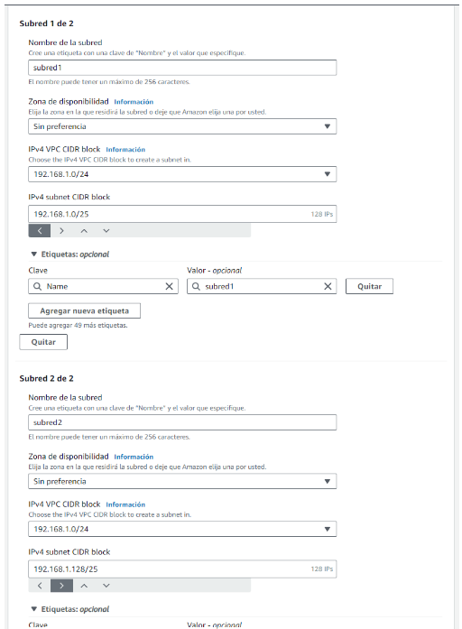
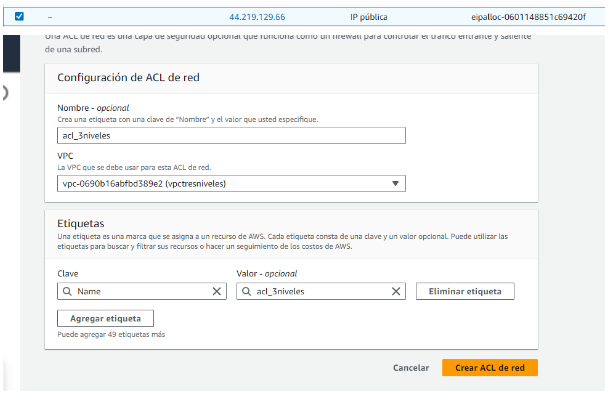

Editamos reglas de entrada

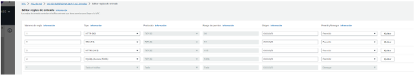

Editamos las reglas de salida

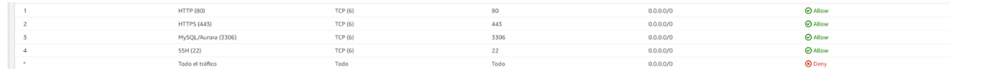

Creamos las Instancias 
Las instancias que he usado son debian 

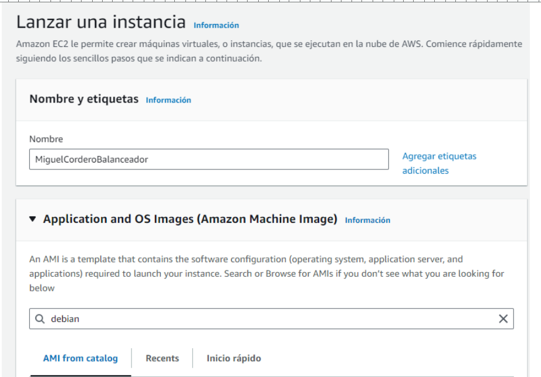
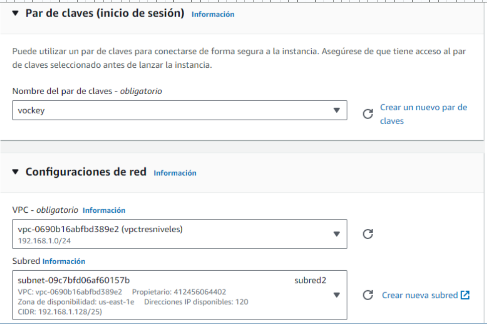

A continuación vamos a asociar una ip estática al balanceador para poder conectarnos y tener acceso a internet.

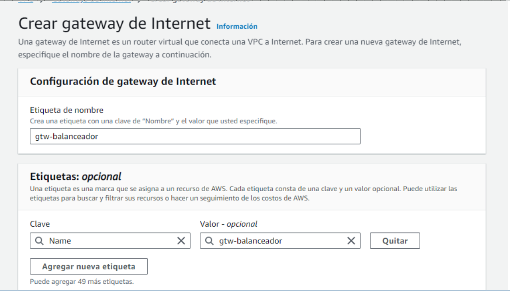

Conectamos la gateway antes creada a internet.

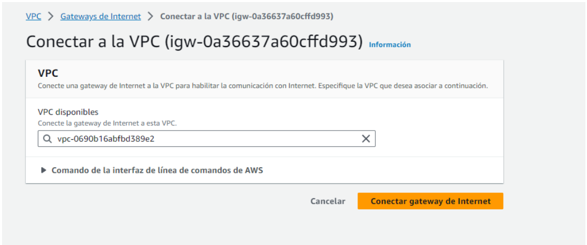

Luego nos vamos a asociar una dirección ip elástica para tener accesoa internet desde el balanceador.

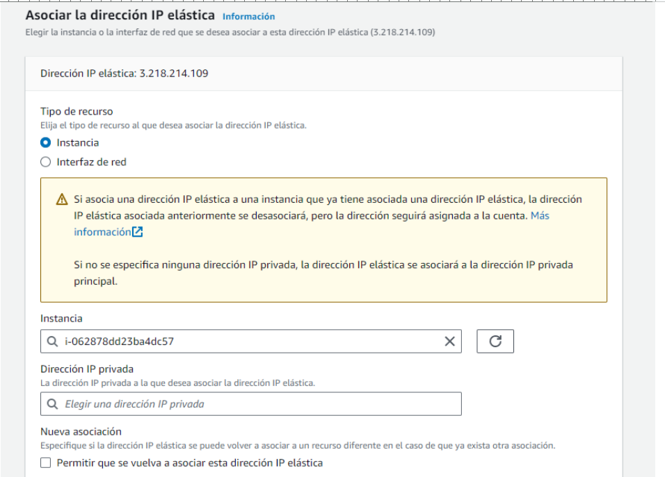

Aquí podemos ver que nos la ha asociado al balanceador

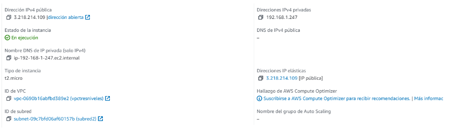

Se me olvidaba decir que tenemos que poner una puerta de enlace a internet para poder tener internet en la otras máquina mientras las configuramos y descargamos los archivos necesarios.

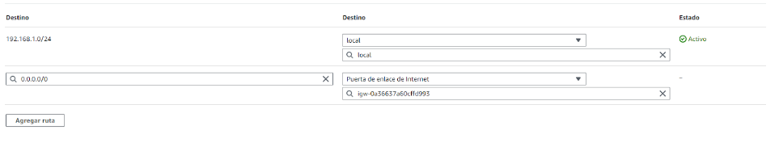

-Configuración del balanceador

Copiamos el contenido del archivo default por si liamos y le ponemos un nombre para saber cual es.
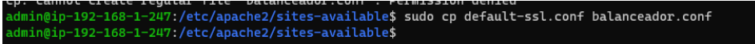

A continuación dentro del balanceador copiamos lo siguiente
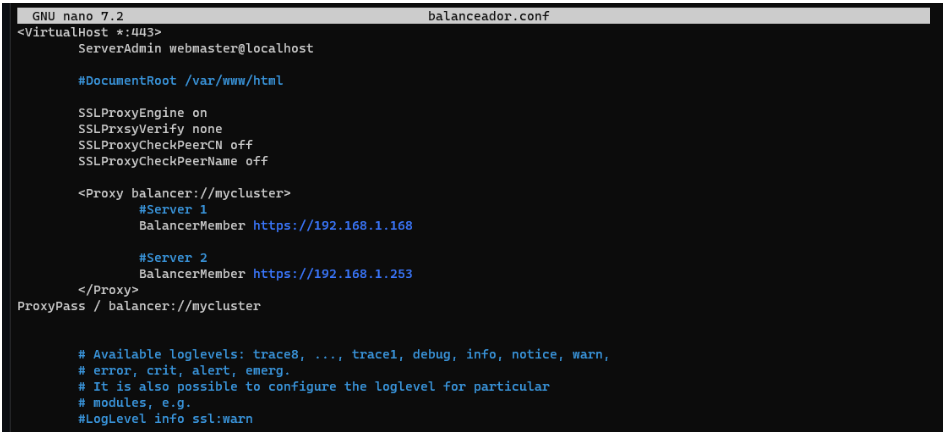

Luego de copiar lo anterior habilitamos el sitio web con a2ensite y le damos los permisos

Nos vamos a nuestro explorador y  ponemos la ip del balanceador

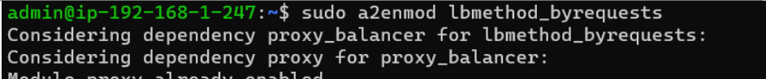
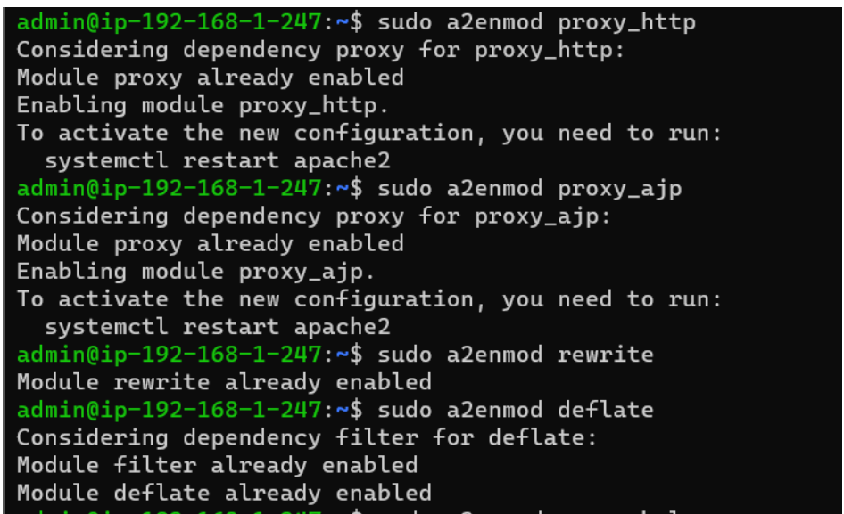
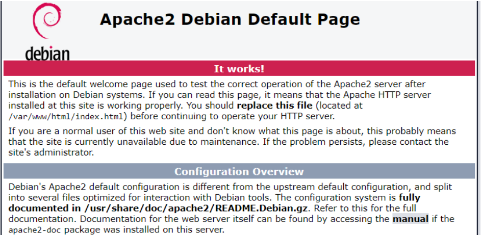

Pero como queremos que nos muestre la página con un certificado vamos a instalar certbot y configurar un nombre de dominio.

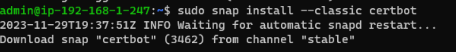
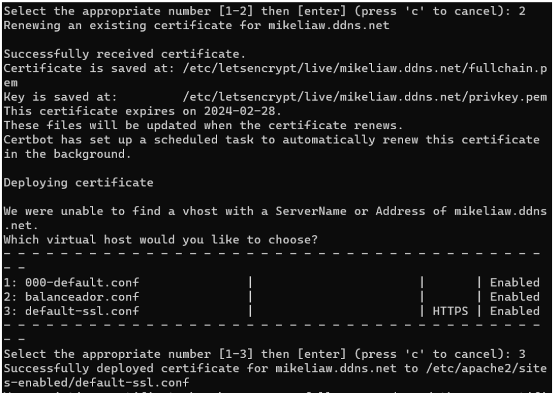

Comprobamos que el certificado está activo y asociado.

Configuración del servidor de apache 1

sudo apt update
sudo apt install -y apache2
sudo apt install php libapache2-mod-php php-mysql

Volvemos a copiar el archivo por si la volvemos a liar

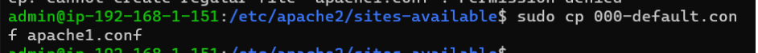

En documentroot la ruta donde tiene que buscar el index.php.

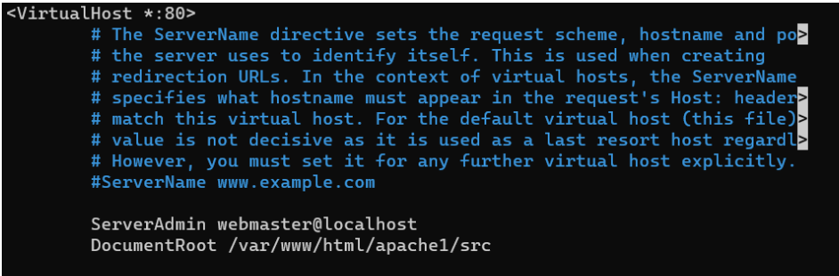

Activamos el sitio que acabamos de configurar

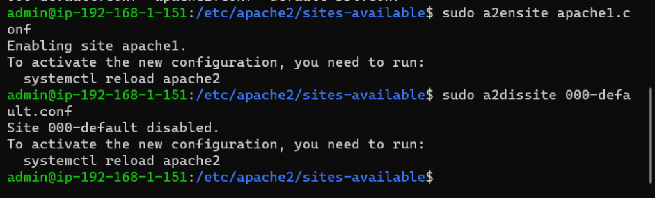

Copiamos el repositorio git dónde está la aplicación que queremos implementar en la página web.

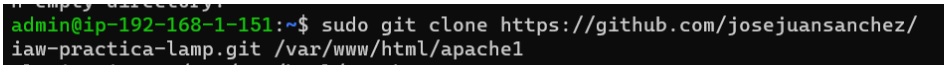
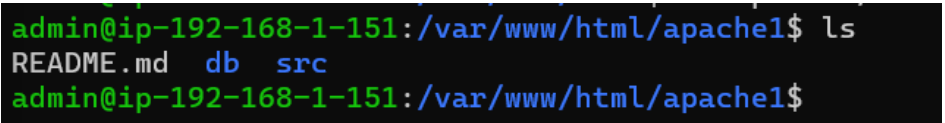

Luego vamos al archivo config en el apache1

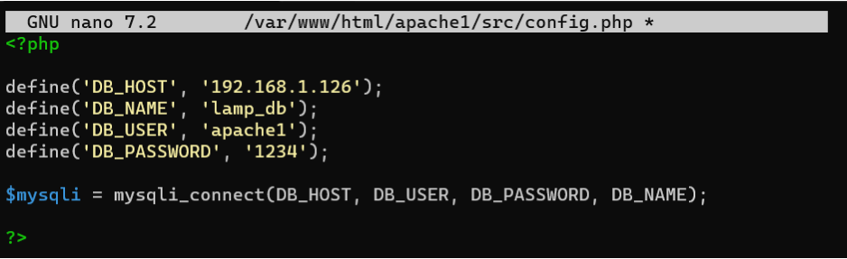

Le tenemos que dar permisos al la carpeta apache1

Sudo systemctl restart apache2
Instalamos mariadb-client para conectarnos al servidor de base de datos

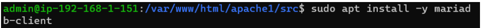

Pasamos la base de datos al servidor mysql

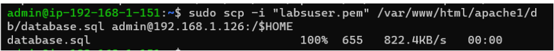

Configuración del servidor de base de datos (MYSQL)

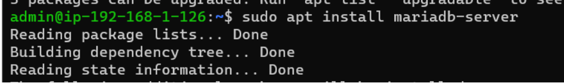

Nos vamos al archivo 50-server.conf y donde esta el bind-address ponemos la ip del server mysql

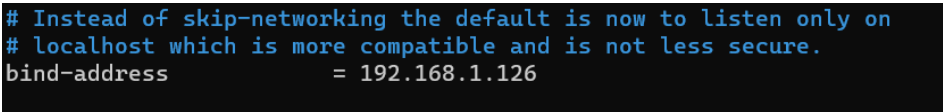

Entramos a la base de datos y metemos un usuario para la base de datos que hemos pasado antes

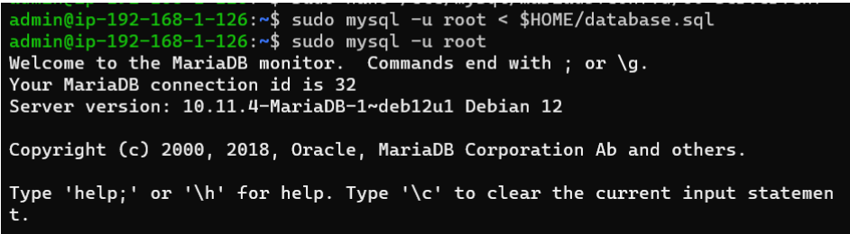
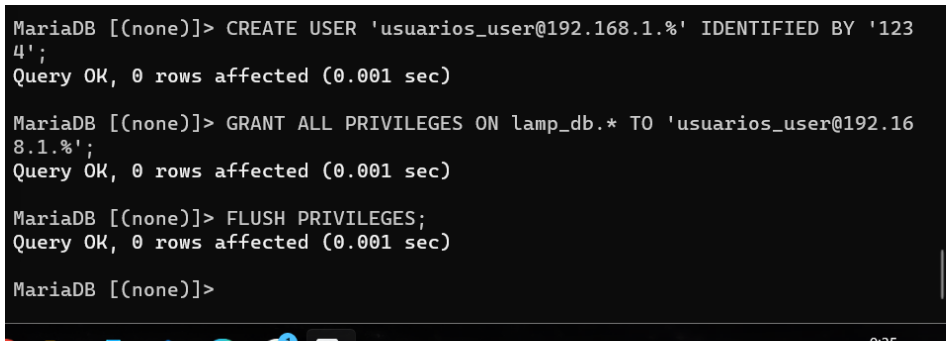
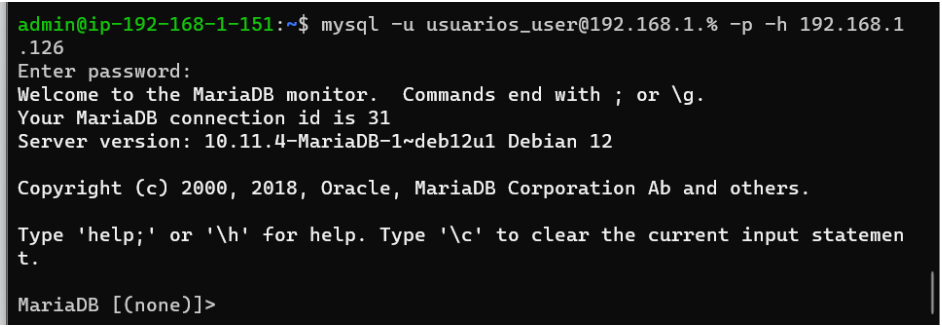

Si todo sale bien cuando ponemos nuestro nombre de dns saldra la pagina donde podemos ingresar, eliminar o editar los usuarios de la base de datos.

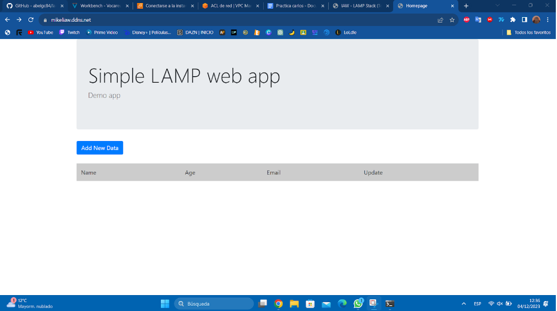
