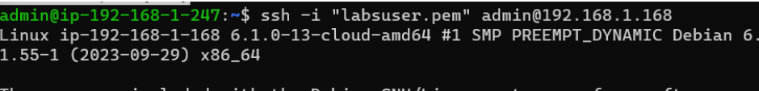
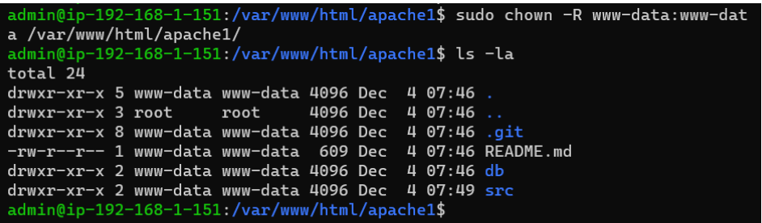

# Cordero_Miguel_RecISO

# Índice.
1. [Introducción.](#introducción)
2. [Infraestructura.](#infraestructura)
   * [Infraestructura de red.](#infraestructura-de-red)
3. [Resultado.](#Resultado)

# Introducción.

En este proyecto se realiza la infraestructura de una pila LAMP en tres niveles sobre máquinas virtuales en AWS.

En un primer nivel tendremos el balanceador de carga.
En el segundo nivel tendremos dos servidores web en Backend.
En el tercer nivel tendremos el servidor de bases de datos.

# Infraestructura.

En este proyecto se explicarán detalladamente los pasos a seguir para la creación de la infraestructura necesaria.

## Infraestructura de red.

#### VPC

En primer lugar creamos una VPC. Vamos al menú de servicios de AWS, elegimos VPC y pulsamos sobre el botón de Crear VPC.

En este menú tenemos dos opciones, Solo la VPC y la opción VPC y más. La diferencia entre ellas es que con la primera solo creamos la VPC y con la segunda podemos crear las subredes, las tablas de enrutamiento y las puertas de enlace desde el mismo menú.

Primero tenemos que crear nuestras vpc donde vamos a albergar nuestras dos subredes la subred 1 donde estará el Balanceador junto a nuestros servidores apache y en la segunda subred donde se almacenará el servidor mysql.

Editamos reglas de entrada

Editamos las reglas de salida

Creamos las Instancias 
Las instancias que he usado son debian 

A continuación vamos a asociar una ip estática al balanceador para poder conectarnos y tener acceso a internet.

Conectamos la gateway antes creada a internet.

Luego nos vamos a asociar una dirección ip elástica para tener accesoa internet desde el balanceador.

Aquí podemos ver que nos la ha asociado al balanceador

Se me olvidaba decir que tenemos que poner una puerta de enlace a internet para poder tener internet en la otras máquina mientras las configuramos y descargamos los archivos necesarios.

-Configuración del balanceador

Copiamos el contenido del archivo default por si liamos y le ponemos un nombre para saber cual es.

A continuación dentro del balanceador copiamos lo siguiente

Luego de copiar lo anterior habilitamos el sitio web con a2ensite y le damos los permisos

Nos vamos a nuestro explorador y  ponemos la ip del balanceador

# Resultado

Pero como queremos que nos muestre la página con un certificado vamos a instalar certbot y configurar un nombre de dominio.

Comprobamos que el certificado está activo y asociado.

Configuración del servidor de apache 1

sudo apt update
sudo apt install -y apache2
sudo apt install php libapache2-mod-php php-mysql

Volvemos a copiar el archivo por si la volvemos a liar

En documentroot la ruta donde tiene que buscar el index.php.

Activamos el sitio que acabamos de configurar

Copiamos el repositorio git dónde está la aplicación que queremos implementar en la página web.

Luego vamos al archivo config en el apache1

Le tenemos que dar permisos al la carpeta apache1

Sudo systemctl restart apache2
Instalamos mariadb-client para conectarnos al servidor de base de datos

Pasamos la base de datos al servidor mysql

Configuración del servidor de base de datos (MYSQL)

Nos vamos al archivo 50-server.conf y donde esta el bind-address ponemos la ip del server mysql

Entramos a la base de datos y metemos un usuario para la base de datos que hemos pasado antes

Si todo sale bien cuando ponemos nuestro nombre de dns saldra la pagina donde podemos ingresar, eliminar o editar los usuarios de la base de datos.

